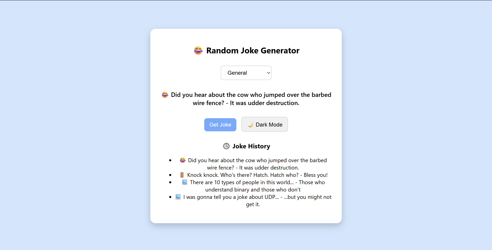
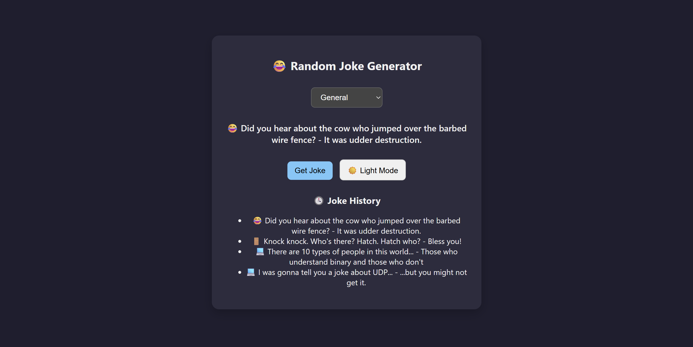

# 😂 Random Joke Generator – Fun for Devs & Normies😎

A playful web app that fetches and displays random jokes from various categories like **Programming**, **General**, and **Knock-Knock** using the [Official Joke API](https://official-joke-api.appspot.com/).

> Built using HTML, CSS, and JavaScript — a fun side project to brighten your day and your portfolio!

---

## 🚀 Features

- 🎭 **Category Selector** – Choose from Programming, General, or Knock-Knock jokes  
- 🎨 **Dark/Light Mode** – Switch themes to suit your vibe  
- 📜 **Joke History** – Keeps the last 5 jokes visible on the screen  
- 📱 **Responsive UI** – Works beautifully on desktops, tablets, and phones  
- 🤖 **Emoji-enhanced UI** – Jokes are served with a matching emoji for extra flair  

---

## 🛠️ Tech Stack

| Frontend      | API                                         | Styling                        |
|---------------|---------------------------------------------|--------------------------------|
| HTML, CSS, JS | [Official Joke API](https://official-joke-api.appspot.com) | Responsive CSS + Theme Toggle |

---

## 📸 Screenshots

| Light Mode | Dark Mode |
|------------|-----------|
|  |  |

---

## 📦 How to Run Locally

```bash
# Clone the repository
git clone https://github.com/KDeveeAnanya/random-joke-generator.git

# Open the folder
cd random-joke-generator

# Just open index.html in your browser
